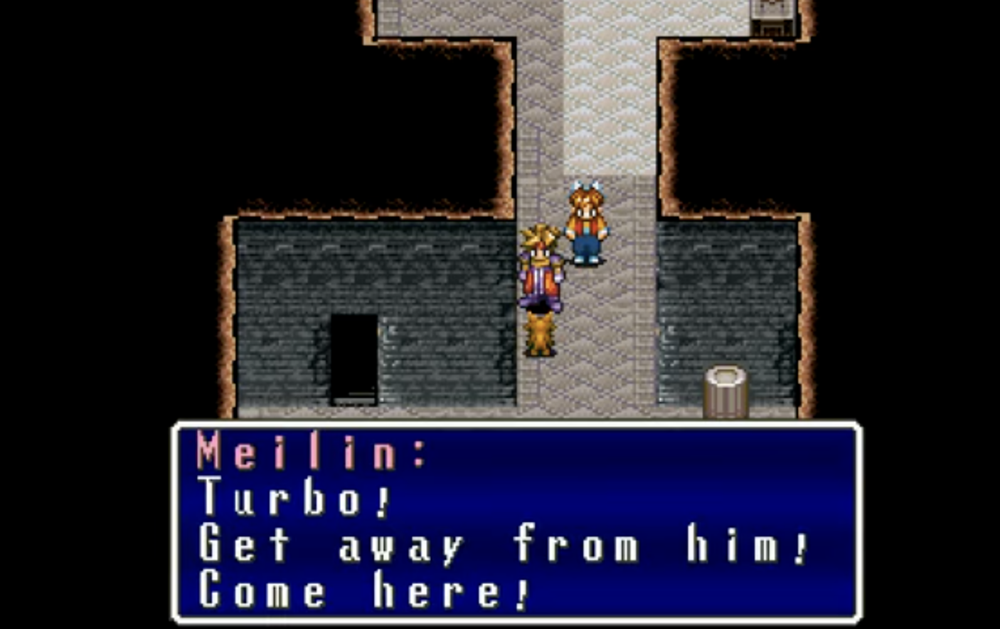

# Playing with Simulated People

## Conditional NPC Dialogue



Create small narrative experience that centers around speaking with non-player characters with dialogue created using [ADialogueSystem and a spreadsheet](https://github.com/mtreanor/ADialogueSystem). 

The prototype requirements are:

- There should be at least 4 NPCs with unique dialogue
- The player should have a goal that when met progresses the `quest state` (a "lock/key puzzle")
- The two `quest states` should have different dialogue for each character
- At least 2 of the characters should use the conditions to have dialogue that is dependent on the blackboard (see below)
- **BONUS:** Have your characters be 3D models with animations!

### A Dialogue System

"A Dialogue System" is a character dialogue toolset for Unity that allows authors to create conditional character dialogue using google sheets. The system allows authors to dynamically create state data, and dynamically select dialogue based on that state. The state can also be accessed and modified from outside the spreadsheet as well. Go [here to download A Dialogue System](https://github.com/mtreanor/ADialogueSystem/blob/main/ADialogueSystem.unitypackage) and see its [GitHub page for setup instructions](https://github.com/mtreanor/ADialogueSystem) for further instructions.

In this system, dialogue is structured around a "quest state" that defines the broad chapter or level in which it applies. Each dialogue entry is associated with a character and consists of two conditions and an effect. Authors can read from and write to a shared "blackboard," a state storage system that tracks labeled data. Conditions act as queries to the blackboard, determining whether a dialogue line is triggered, while effects allow authors to update the blackboard, modifying the game's state dynamically.

At the approprite time for your game, you can modify the `DialogueManager.scc.questState` variable to move on to the next set of character dialogue options.

### Visual Asset Resources

- [Mixamo](https://www.mixamo.com/)
- [City People FREE Samples](https://assetstore.unity.com/packages/3d/characters/city-people-free-samples-260446)
- [Kenney Animated Characters](https://kenney.nl/assets/animated-characters-1)

### Turning in your prototype

Your prototype should be playable at:

```
http://<YOUR_GITHUB_USERNAME>.github.io/game-dev-spring2025/builds/people-1
```

## Interactive NPC Dialogue

Last week you used my custom conditional dialogue system, and this week you be making creative use of a more fully featured interactive narrative tool, [Ink](https://www.inklestudios.com/ink/) in order to have interactive character dialogue (note, you are not required to use Ink if you think you can achieve scalable/interesting interactive dialogue in some other way - e.g. building off of ADialogueSystem).

The requirements of this prototype are:

- There should be some amount of introductory text that establishes the scene (story world, who the characters are, etc.)
- There needs to be at least **two** interactions with NPC's where the player's choices influence the conversation.
- [BONUS] You make use of singular "reusable" patterns of character interactions where the flow of the conversation is determined in part by game state (e.g. how smart someone is, or how much money somehow has, etc.)

### Setup

- To use Ink, [you will need to download and install Inky](https://www.inklestudios.com/ink/) (the Ink authoring tool) onto your machine.
- Here's the [official tutorial for Ink](https://www.inklestudios.com/ink/web-tutorial/).
- [Go here to see instructions for how to use Ink with Unity](https://github.com/inkle/ink/blob/master/Documentation/RunningYourInk.md). 
    - NOTE: Between [my example](https://github.com/mtreanor/game615-spring2025/blob/main/examples/people/Assets/InkStoryManager.cs) and the demo project located that comes with the Unity package (Ink/Demos/Basic Demo/Scripts/BasicInkExample.cs), there should be examples for how to use Ink. My advice is to condict various "experiments" proving to yourself that you can work with Inky and Unity back and forth between you do a ton of writing.

### Using my example

[Get the unitypackage here]([InkStoryManager.cs](https://github.com/mtreanor/game615-spring2025/blob/main/examples/people/inkDemo.unitypackage)).

I have created a function called `LaunchKnot` that is expected to be called as a coroutine. E.g. `StartCoroutine(LaunchKnot("IntroductoryScene"));`. In order for this to work, you need to create the following UI elements and assign them to [InkStoryManager.cs](https://github.com/mtreanor/game615-spring2025/blob/main/examples/people/Assets/InkStoryManager.cs):

1. A Text box game object, called TextBoxUI in my example. This will contain the text from Ink.
2. A text box that is a child of TextBoxUI to assign to TextBox.
3. An empty GameObject on the canvas with a Layout (e.g. GridLayout, HorizontalLayout) conponent to assign to ChoicesUI.
4. A prefab that will be instantiated whenever a choice is present. It should be a button.

### Turning in your prototype

Your prototype should be playable at:

```
http://<YOUR_GITHUB_USERNAME>.github.io/game-dev-spring2025/builds/people-2
```