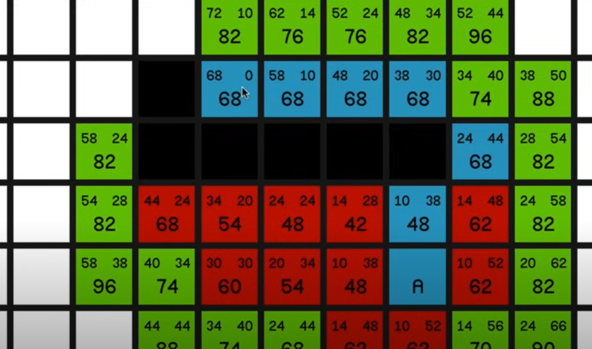

# Simulation

## A Grid-based Simulation - part 1

*Due 3-26-25*


Create a grid-based simulation, where each cell in the grid has a state that evolves through input and time passing, and the state of each cell is visualized (however minimally) to the player in some way. 

The way that your simulation evolves should be determined by at least two competing *local* factors that the player has influence over somehow. By local factors, I mean that a cell should be updated based on the surrounding cells in some way. The player should be able directly change something about the cells to influence these. By *competing*, I mean that there should be some factor that causes a state value to go up, and some other factor that causes it to go down.

As an example, consider a world where cells have a notion of the "happiness" of the cell's inhabitants. The happiness score goes up if the cell can reach a "park" via a "road" (you could imagine a number of pathplanning ways to determine this ranging from simple to complex). The player can place the roads. The happiness value of the cell is also negatively influenced by the "pollution" of the world. The pollution value is determined by how many roads there are. In this way, happiness is influenced by two competing factors: parks and roads. 

Note that you may not want to use roads/path planning at this point, and elect to simulate something simpler. In fact, I encourage you to think simply at this point.

Your game should be playable at the following link:

```
http://<YOUR_GITHUB_USERNAME>.github.io/game-dev-spring2025/builds/simulation-1
```

## A Grid-based Simulation - part 2

*Due 4-2-25*



NOTE: For this assignment you will be working in a group of three. Feel free to either start from one of your previous projects, or to start from scratch.

The main activity of this prototype is for you to integrate pathplanning into your each cell's update function. For example, a cell might compute part of its "health" value by calculating the length of the path to the nearest hospital. You could also limit the path to only be on roads, or to have the "quality" of a path (what that means is up to you), affect how the cell is updated. 

In addition to integrating pathplanning, you need to meaningfully visualize the state of the cell.

### Resources

In order to do this, you will need to have an implementation of a path planning algorithm. For a starter project and full implementation of A*, [go here](https://github.com/mtreanor/game615-spring2025/blob/main/examples/simulation/aStarStarterPackage.unitypackage) ([https://github.com/mtreanor/game615-spring2025/blob/main/examples/simulation/aStarStarterPackage.unitypackage](https://github.com/mtreanor/game615-spring2025/blob/main/examples/simulation/aStarStarterPackage.unitypackage)) and click on the "download raw" button. This will download a Unity Package that can be dragged and dropped into your project. This will open a window asking what you want to import. Import everything. To make the example work, you will need to do two things:

1. Drag the "GridManager" prefab into the Scene.
2. Select the Cell prefab, create a "cell" layer, and apply that layer to the cell (and its children if it asks).

To begin experimenting with using pathplanning to influence each cell's evolution, you will want to experiment with a few functions in `GridManager.cs`:

- `SimulationStep()`: This is the function that gets called at a rate (`nextSimulationStepRate`). The current loops through all cells, and asks them to generate their next state. Inside of `CellScript.cs`'s `GenereateNextSimulationState()`, you can see an example of each cell updating its height based on averaging all of its neighbor's neight (`ApplyMountainSmoothing()` - or Gaussian Blurring)
- `AStarPath()`: This is currently implemented as a corouting to assist with the visualization, but I would recommend modifying it to return a list of CellScripts (which is the path).
- `GetNeighbors()`: This function currently just returns all of the cells that touch a given cell. You could imagine modifying this to only return cells that are "roads". This would make all paths be constrained to those with roads on them (which from a gameplay point of view makes laying roads down essential and fun!).
- `CalculateCost(CellScript a, CellScript b)`: This returns how much the algorithm thinks it costs to move from one cell to another. Currently all movement is just 1, however, you could imagine making it "move expensive" to move to higher pollution areas, or "cheaper" to move between cells of the same type, or any other such thing.
- `Heuristic(CellScript a, CellScript b)`: You may want to experiment with how the algorithm "guesses" how much it will costs to get to the end.

